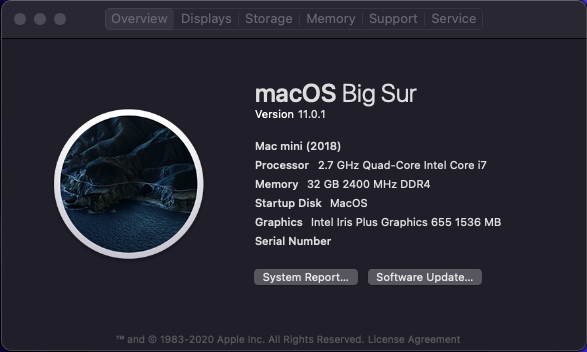

# NUC8I7BEH Hackintosh OpenCore 0.5.9 UEFI

* boot with OpenCore GUI
* can dual-boot with **Windows 10** on another seperate m2.ssd 
* remember pull out **Windows 10** ssd/harddisk before start to install Hackintosh on another ssd
* place **Windows Boot Manager** under Hackintosh disk on the BIOS UEFI startup

Intel Wifi kext, Max Download Speed 30mbps
 - credit to: PC Video / Games Channel on YouTube
 - link to this video
 https://www.youtube.com/watch?v=kHfUjJ2RkyU
 
 Remove ExpressCard icon
  - credit to: weachy on JianShu
  - link to this tutorial (in Chinese Simplified)
  https://www.jianshu.com/p/b298da6afef3
  
   
   
 Steps: run this command on terminal
  * Step 1: sudo mount -uw / && killall Finder
  * Step 2: fn=".`date +%s`" && sudo mv /System/Library/CoreServices/Menu\ Extras/ExpressCard.menu /System/Library/CoreServices/Menu\ Extras/ExpressCard.menu$fn && sudo touch /System/Library/CoreServices/Menu\ Extras/ExpressCard.menu

Done, now reboot your system, and the ExpressCard icon will be disappear

works but ...
 * line-in mic (sound bit loose)
 
not yet test
 * thunderbolt 3 port
 * micro-sd slot
 * airdrop and sidecar
 
specs
  * OS: macOS Catalina 10.15.5/Macmini8,1
  * CPU: Intel® Core™ i7-8559U Processor (8M Cache, up to 4.50 GHz)
  * SSD: 960GB KINGSTON A400 2.5 SATA
  * RAM: 16GB X 2 HYPERX DDR4 2400
  * BIOS: 0078
  * MONITOR: LG29WK600
  
bootloader
  * OpenCore 0.5.9
  * OpenCore 0.5.7
 
how to install
  * Disable **Legacy Boot** on the BIOS
  * Create bootable USB with macOS Catalina (Windows or Mac)
  * Copy OC/0.5.9/EFI to your BOOT folder
  * Change your mac serial number in OC/**config.plist**
  
tips
  * use ProperTree and GenSMBIOS files to change your mac serial number and etc.
  * can use Clover Configurations or MountEFI application to mount the harddisk
  
credits

**Youtube Video**
  * https://www.youtube.com/watch?v=p3epD8qqVeA&t=1367s
  * https://www.youtube.com/watch?v=6KGuINOyHh0&t=1137s
  
**Article**
  * https://dortania.github.io/OpenCore-Desktop-Guide/
  * https://github.com/csrutil/NUC8I5BEH

  * https://www.jianshu.com/p/b298da6afef3
  * https://www.jianshu.com/p/78510cfa4a64
  
**IntelBluetoothFirmware**
  * https://github.com/zxystd/IntelBluetoothFirmware/releases/
  
**AppleALC_CodecGuide**
  * https://github.com/acidanthera/AppleALC/wiki/Supported-codecs
